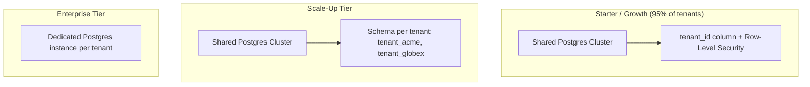
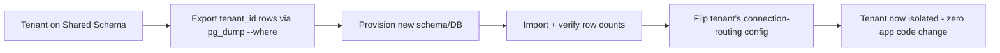

# PrimeOSApp — Multi-Tenant Data Isolation Design

**Goal:** Every business owner's data (customers, revenue, costs, activities, etc.) must be completely invisible to every other tenant, while all tenants share the same application infrastructure — because running a separate stack per customer would kill unit economics.

---

## 1. Tenancy Model Options (and which PrimeOSApp uses where)

| Model | Description | Isolation | Cost | Used For |
|---|---|---|---|---|
| **Shared DB, shared schema, `tenant_id` column** | All tenants in one table, filtered by `tenant_id` | Logical only | Lowest | Starter/Growth tiers (default) |
| **Shared DB, schema-per-tenant** | Each tenant gets its own Postgres schema | Medium | Medium | Optional upgrade for mid-market |
| **Database-per-tenant** | Each tenant gets a dedicated database/cluster | Strongest | Highest | Enterprise tier, regulated industries |

PrimeOSApp uses a **hybrid, tier-based model**: shared schema by default (cheapest, fastest to scale horizontally), with the ability to "graduate" a large or compliance-sensitive tenant to schema-per-tenant or DB-per-tenant without changing application code — because every query already goes through the tenant-context layer described below.



---

## 2. Enforcement Layers (defense in depth)

Isolation is never enforced in just one place — a bug in application code should not be able to leak data. PrimeOSApp enforces tenancy at **four independent layers**:

### Layer 1 — Authentication: Tenant Resolution
Every request carries a JWT issued by Keycloak/Auth0 containing a `tenant_id` claim. The API Gateway validates the token and injects `tenant_id` as a trusted header (`X-Tenant-Id`) before forwarding to any microservice — the frontend can never set this directly.

```
JWT payload:
{
  "sub": "user_uuid",
  "tenant_id": "acme_corp_uuid",
  "role": "finance_admin",
  "scopes": ["cost-x:read", "cost-x:write"]
}
```

### Layer 2 — Application: Tenant Context Middleware
Every microservice wraps incoming requests in a tenant context that's threaded through the entire request lifecycle — no query can be written without it.

```typescript
// NestJS example — tenant context middleware
@Injectable()
export class TenantContextMiddleware implements NestMiddleware {
  use(req: Request, res: Response, next: NextFunction) {
    const tenantId = req.headers['x-tenant-id'];
    if (!tenantId) throw new UnauthorizedException('Missing tenant context');
    // AsyncLocalStorage keeps tenantId available to every downstream
    // service/repository call without passing it as a parameter everywhere
    tenantContextStorage.run({ tenantId }, () => next());
  }
}

// Repository base class — every query is auto-scoped
class TenantScopedRepository<T> {
  find(criteria: object) {
    const { tenantId } = tenantContextStorage.getStore();
    return this.db.query(criteria, { tenant_id: tenantId }); // always injected
  }
}
```
This means an engineer writing a new feature *cannot accidentally* forget the tenant filter — it's structurally impossible to query without it, rather than a convention they have to remember.

### Layer 3 — Database: Row-Level Security (PostgreSQL)
Even if application code had a bug, Postgres itself refuses to return rows outside the current tenant, using native Row-Level Security policies:

```sql
-- Enable RLS on every tenant-scoped table
ALTER TABLE customers ENABLE ROW LEVEL SECURITY;

CREATE POLICY tenant_isolation_policy ON customers
  USING (tenant_id = current_setting('app.current_tenant')::uuid);

-- Each connection sets its tenant context at the start of a transaction
SET app.current_tenant = 'acme_corp_uuid';
SELECT * FROM customers; -- physically cannot return other tenants' rows
```
This is the single most important safety net: it means a leaked JWT scope bug, an ORM misconfiguration, or a raw SQL mistake in a one-off script still can't cross tenant boundaries.

### Layer 4 — Infrastructure: Network & Secrets Isolation (Enterprise tier)
For tenants on dedicated databases, isolation extends to the infrastructure layer:
- Separate Kubernetes namespace or VPC per enterprise tenant
- Separate database credentials stored in per-tenant Vault paths
- Dedicated Kafka topic prefixes (`tenant.acme.customer.created`) so even the event bus can't cross-pollinate

---

## 3. Per-Datastore Isolation Strategy

| Datastore | Isolation Mechanism |
|---|---|
| **PostgreSQL** (CRM-X, COST-X, ACT-X, PART-X, RES-X, REV-X) | `tenant_id` column + Row-Level Security policies (Section 2, Layer 3) |
| **MongoDB** (SEG-X, VALUE-X) | `tenant_id` field on every document + mandatory query middleware that injects the filter; enterprise tenants get a dedicated database within the cluster (`db_acme_segx`) |
| **MySQL** (CHAN-X) | Same `tenant_id` pattern; MySQL 8 lacks native RLS, so enforcement relies on Layers 1-2 plus a database proxy (ProxySQL) that rejects any query missing a tenant filter |
| **Redis** (REV-X caching) | Key namespacing: `tenant:{tenant_id}:revenue:{customer_id}` — never a bare key |
| **Kafka** (Event Bus) | Every event payload carries `tenant_id`; consumers filter on it, and high-tier tenants get dedicated topic partitions to prevent noisy-neighbor throughput issues |
| **Analytics Warehouse** | Partitioned tables by `tenant_id` (BigQuery/Snowflake clustering keys), with row-access policies mirroring the Postgres RLS model |

---

## 4. Cross-Tenant Leak Prevention Checklist

- [ ] No raw SQL/Mongo queries in application code without going through the tenant-scoped repository layer
- [ ] RLS enabled on every table containing tenant data — enforced via a CI check that fails the build if a new table lacks a policy
- [ ] Background jobs (cron, batch ETL) run with an explicit tenant loop — never a "process all rows" query
- [ ] Support/admin tooling uses a separate, heavily audited "impersonation" flow (time-boxed, logged, requires the tenant's consent flag) rather than direct DB access
- [ ] Automated test suite includes tenant-isolation tests: create two tenants, assert Tenant A's API token can never retrieve Tenant B's data, on every microservice
- [ ] Penetration testing includes explicit IDOR (Insecure Direct Object Reference) testing across tenant boundaries before each major release

---

## 5. Compliance Considerations (Brazil + LATAM + Global)

Since PrimeOSApp will serve businesses across 11 market segments, likely spanning multiple countries:

- **LGPD (Brazil):** requires clear legal basis for processing, data subject access/deletion rights, and breach notification — tenant isolation is foundational to satisfying "adequate technical measures" requirements.
- **GDPR (if EU customers):** similar requirements, plus data residency — enterprise EU tenants may need their dedicated database physically hosted in an EU region.
- **Data residency by tier:** the schema-per-tenant and DB-per-tenant options aren't just about security — they let you offer "your data stays in Brazil/EU/US" as a sellable enterprise feature.

---

## 6. Migration Path Between Tiers

Because every service already queries through `tenant_id`, moving a tenant from shared-schema to dedicated-schema (or dedicated-DB) is a **data migration, not a code migration**:


This lets you start every customer on the cheap shared-infrastructure tier by default, and only pay the cost of dedicated infrastructure for the tenants who actually need or will pay for it (typically <5% of the base in a normal SaaS distribution).

---

## 7. Summary

| Concern | Mechanism |
|---|---|
| A hacker steals one tenant's JWT | RLS still blocks cross-tenant rows even if app-layer scoping is bypassed |
| A developer writes a buggy query | Tenant-scoped repository makes it structurally hard to omit the filter |
| An enterprise customer demands data residency | Tier upgrade to dedicated DB/region, no code changes |
| A regulator asks how you prevent data leaks | Four-layer defense (auth, app, DB, infra) — not a single point of failure |
